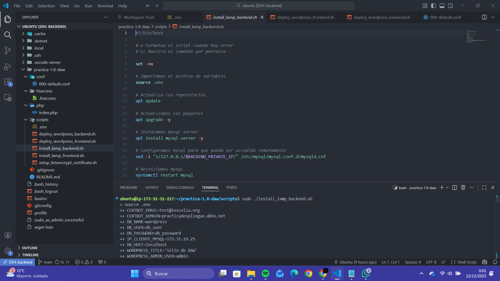
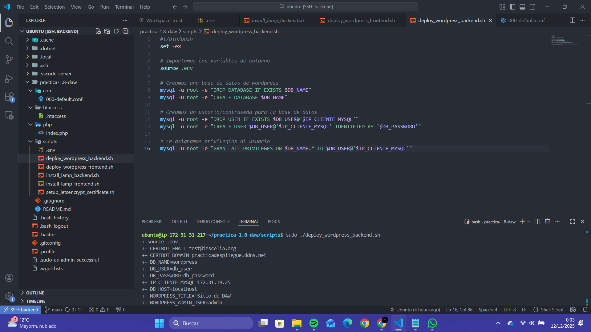
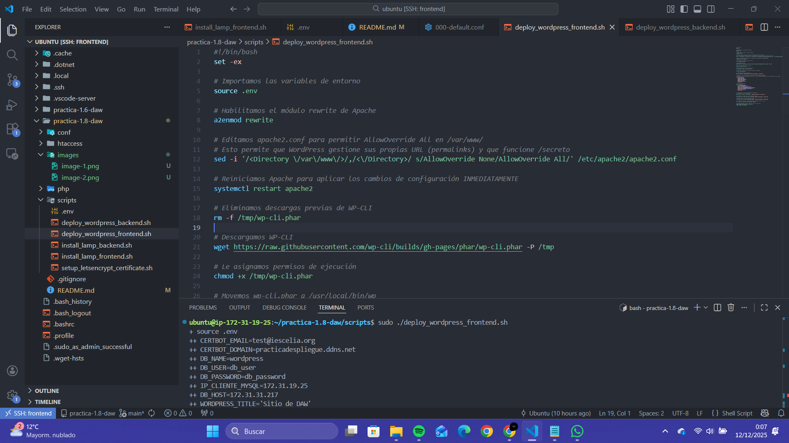
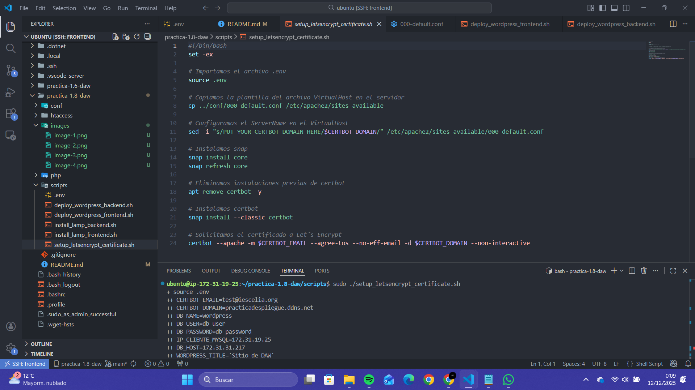
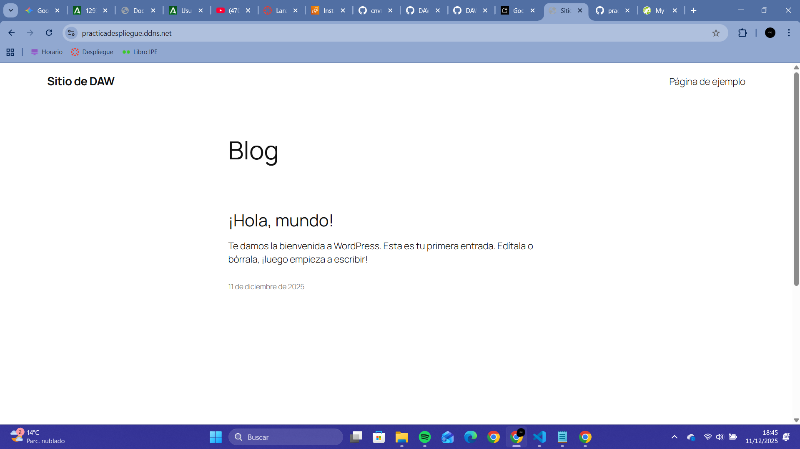
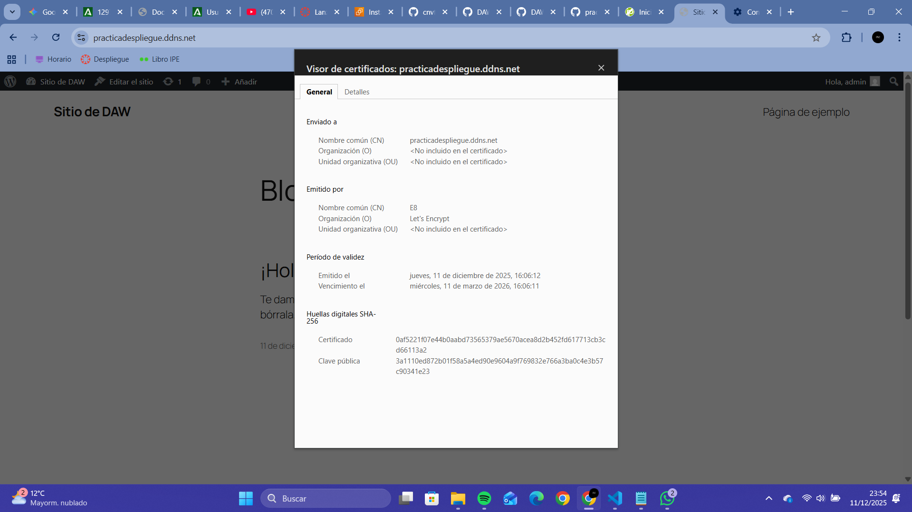
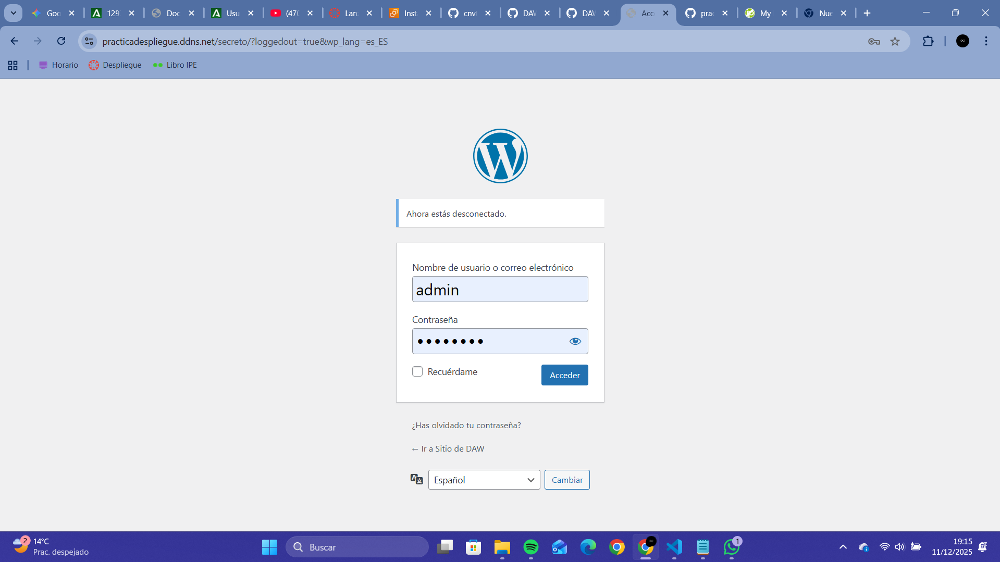
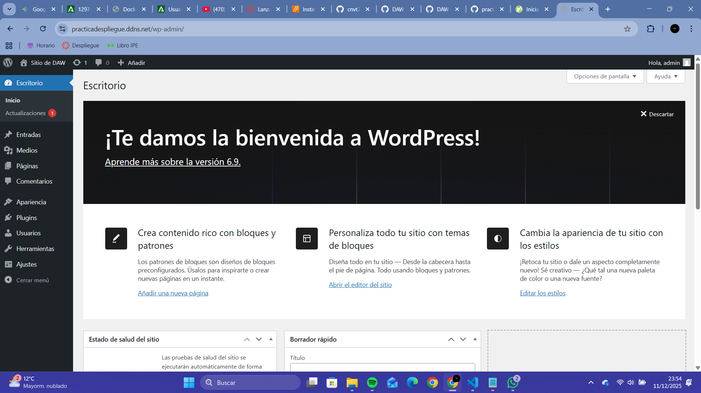

# Despliegue de WordPress con Arquitectura LAMP Distribuida en AWS

Esta práctica documenta el despliegue de una aplicación web basada en WordPress utilizando una arquitectura de dos niveles distribuida en instancias EC2 de Amazon Web Services (AWS). El proceso fue completamente automatizado mediante scripts de shell para una implementación eficiente de la pila LAMP (Linux, Apache, MySQL, PHP).

La arquitectura se compone de:

1. **Capa Backend** (Base de Datos). Una instancia EC2 que aloja exclusivamente el MySQL Server.

2. **Capa Frontend** (Servidor Web). Una instancia EC2 que ejecuta Apache HTTP Server y PHP, sirviendo la aplicación WordPress.

Ambas máquinas se comunican de forma segura a través de la red privada de AWS. Adicionalmente, se configuró un certificado SSL/TLS de Let's Encrypt para asegurar la comunicación por HTTPS y se implementó la ocultación de la URL de administración de WordPress como medida de seguridad.

## Documentación técnica

### 1. Requisitos de Infraestructura y Seguridad

Se configuraron los Security Groups de AWS para controlar el flujo de tráfico entre las instancias:

1. **Backend (MySQL)**. Solo permite tráfico en el puerto 3306 (MySQL) procedente exclusivamente de la IP Privada del Frontend. 

2. **Frontend (Apache)**. Permite tráfico en los puertos HTTP (80), HTTPS (443) y SSH (22) desde cualquier origen (0.0.0.0/0).

### 2. Configuración del Backend (Servidor MySQL)

La configuración del backend fue esencial para permitir la comunicación remota.

1. **Instalación de MySQL y Ajuste de Red**. El script install_lamp_backend.sh instaló el servidor MySQL y modificó la configuración de bind-address. Se cambió el valor por defecto (127.0.0.1) a la IP privada del propio backend para permitir la conexión entrante desde el Frontend a través de la red de AWS.

2. **Despliegue de Base de Datos**. El script deploy_backend.sh creó la base de datos (DB_NAME=wordpress) y el usuario de la base de datos (DB_USER=db_user), asignándole permisos de conexión desde la IP del Frontend.

### 3. Despliegue del Frontend (Servidor Web WordPress)

La capa frontend maneja la lógica de la aplicación y la atención a las peticiones del cliente.

1. **Instalación LAMP**. El script install_lamp_frontend.sh instaló Apache y todos los módulos de PHP necesarios (como php-mysql y php-curl) para el correcto funcionamiento de WordPress.

2. **Deploy de WordPress**. El script deploy_frontend.sh descargó los archivos de WordPress, configuró automáticamente el archivo wp-config.php inyectando las variables de conexión a la base de datos definidas en el archivo .env, y ajustó los permisos del directorio /var/www/html.

### 4. Configuración del Certificado SSL

**Securización HTTPS**. El script setup_letsencrypt_certificate.sh se encargó de configurar un certificado SSL/TLS gratuito utilizando Certbot y Let's Encrypt, asegurando que el sitio web sea accesible vía HTTPS.

## Elementos Clave del Despliegue

**Archivo .env**. Contiene las variables de entorno (credenciales de base de datos, dominios, etc.) que son leídas por los scripts de despliegue, permitiendo la automatización de la configuración sin exponer datos sensibles en el código fuente.

**Scripts de Despliegue**. La ejecución de los scripts de LAMP en el Backend y Frontend automatizó la instalación de paquetes y la configuración inicial.

**Deploy Base de Datos MySQL**. Creación y configuración de la base de datos con un usuario específico para la comunicación desde el servidor web.

**Deploy de WordPress**. Descarga, configuración y puesta en marcha de la aplicación en el Frontend.

### Verificación Final 

La aplicación web es accesible 

El certificado SSL está instalado y funcionando 

Se puede acceder al panel de administración de WordPress.

También, se accedería al panel principal de Wordpress.

